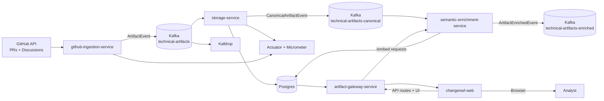
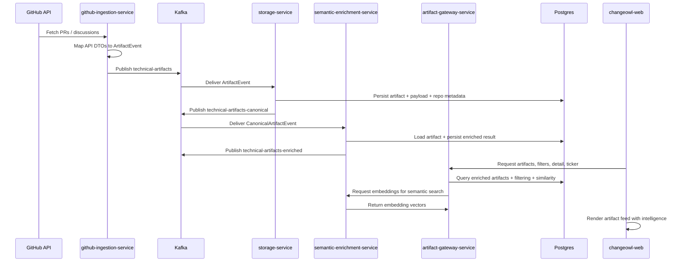

# ChangeOwl 🦉
> **The System Design Reasoning Engine**

ChangeOwl is a multi-module, event-driven platform for turning engineering activity into structured technical intelligence. The current v1 pipeline ingests GitHub pull requests and discussions, normalizes them into canonical events, streams them through Kafka, and persists them for downstream enrichment and analysis. 

## What’s in this repo

### Microservices & Module Breakdown

- **`changeowl-web`**
  - Next.js 16 frontend application for exploring and analyzing enriched artifacts.
  - Displays artifacts in an interactive, virtualized feed with infinite scrolling.
  - Offers multi-dimensional filtering by change type, surface area, risk level, confidence, behavioral impact, and related repositories.
  - Semantic search via embeddings and full-text search integration.
  - Individual artifact detail pages with AI-generated intelligence summary (rationale, intent, risk analysis, impact radius, key points).
	- Real-time connection to the artifact gateway for search, detail, ticker, and vector-based similarity matching.
  - Internationalization support and responsive design with TailwindCSS.

- **`artifact-gateway-service`**
	- Spring Boot query service that powers the frontend and Search Assistant retrieval layer.
	- Reads artifacts, intelligence, repository metadata, and pgvector similarity data from Postgres.
	- Proxies query embedding requests to the semantic enrichment service.
	- Exposes artifact browsing, detail lookup, similar-artifact discovery, and live ticker APIs.

- **`github-ingestion-service`**
  - Spring Boot service that periodically pulls GitHub PRs and discussions.
  - Maps GitHub API responses into the shared `ArtifactEvent` model.
  - Publishes events to Kafka topic `technical-artifacts`.
  - Exposes basic Micrometer/Prometheus metrics and health endpoints.

- **`storage-service`**
  - Kafka consumer that receives `ArtifactEvent` messages.
  - Persists artifacts to Postgres via Spring Data JPA.
  - Stores raw artifact payload and repository/technology linkage data.
  - Republishes a canonical event to `technical-artifacts-canonical` after successful persistence.

- **`changeowl-shared`**
  - Shared contract module used by both services.
  - Contains common event interfaces, canonical event models, and Kafka topic names.

- **`semantic-enrichment-service`**
	- FastAPI + FastStream worker that consumes canonical artifacts from Kafka topic `technical-artifacts-canonical`.
	- Fetches the source artifact from Postgres, generates a technical summary with the Qwen instruct model, and creates an embedding with the Nomic text model.
	- Persists enriched results back to Postgres and publishes `ArtifactEnrichedEvent` messages to Kafka topic `technical-artifacts-enriched`.
	- Sends failed messages to the DLQ topic `technical-artifacts-canonical_dlq`.
	- Exposes an `/embed` endpoint for real-time semantic search queries from the frontend.

- **`agent-service`**
	- Python-based agent service implementing the Search Assistant (agentic RAG).
	- Implements a LangGraph-based agent that performs retrieval-augmented generation using artifact tools, prompts, and state management.
	- Integrates with `artifact-gateway-service` for retrieval and `changeowl-web` for conversational UI and assistant flows.
	- Code lives under `services/agent-service` and includes `app/agents/search_agent` with `graph.py`, `prompts.py`, and `state.py`.

### Infrastructure

- **Kafka** in KRaft mode for event streaming
- **Kafdrop** for topic and consumer inspection
- **Postgres** with **pgvector** support for storage and future vector/semantic workflows
- **Python semantic worker** for model-driven enrichment over canonical artifacts
- **Docker Compose** for local infra bootstrapping

## High-level architecture



## Event flow



## Current implementation status

### Phase 1: Data foundation, ingestion pipeline, and frontend ✅ **STABLE**

What is already implemented:

- Maven multi-module setup with a shared parent POM
- Shared event and topic definitions in `changeowl-shared`
- GitHub ingestion client for PRs and discussions
- DTO-to-domain mapping layer for canonical artifact events
- Kafka producer for the ingestion service
- Kafka consumer, persistence layer, and canonical republishing in storage
- Basic observability with logs, timers, counters, and actuator endpoints
- Semantic enrichment worker with summarization, embeddings, persistence, and DLQ handling
- Artifact gateway service for artifact browsing, ticker data, and semantic search retrieval
- Local infrastructure for Kafka, Kafdrop, and Postgres/pgvector
- **Next.js frontend with artifact feed, multi-dimensional filtering, and semantic search**
- **AI-enhanced artifact intelligence display (risk, confidence, impact analysis)**
- **Real-time vector similarity matching for related artifacts**

### Phase 2: Search Assistant 🚀 **Implemented (agent-service)**

The Search Assistant has been developed and delivered as the `agent-service` — a Python-based, LangGraph-backed agentic RAG integrated into the platform.

What it does now:
- Performs retrieval-augmented generation over `artifact` data with citation-backed answers.
- Uses the `artifact-gateway-service` for retrieval and the semantic-enrichment embeddings for relevance ranking.
- Exposes conversational and programmatic interfaces consumed by `changeowl-web` for assistant UI flows.
- Implements artifact tools, prompt templates, and lightweight agent state for multi-step reasoning.

Next steps / roadmap:
- Expand evidence-ranking and citation quality metrics
- Develop and mature agent tools to expose richer capabilities (artifact tools, prompt templates, orchestration)

## Tech stack

- **Language:** Java 21, TypeScript, Python
- **Build tools:** Maven multi-module, npm, uv (Python)
- **Frameworks:** Spring Boot 3.x, Next.js 16, FastAPI, FastStream
- **Frontend:** React 19, TailwindCSS, Framer Motion, react-virtualized (infinite scroll)
- **Messaging:** Apache Kafka
- **Persistence:** PostgreSQL + Spring Data JPA (Hibernate), Drizzle ORM
- **Semantic models:** SentenceTransformers, Transformers, Torch, pgvector
- **Observability:** Spring Boot Actuator, Micrometer, Pino logging
- **Serialization:** Jackson, Spring Kafka JSON serializers/deserializers
- **Utilities:** Lombok, next-intl (i18n), swr (data fetching)
- **Local infra:** Docker Compose, Kafdrop, pgvector

## Repository layout

```text
changeowl/
├── changeowl-shared/                # Shared event models and Kafka topics
├── services/
│   ├── changeowl-web/               # Next.js frontend for artifact exploration
│   ├── github-ingestion-service/    # GitHub PR/discussion ingestion
│   ├── storage-service/             # Kafka consumer and persistence layer
│   ├── artifact-gateway-service/     # Artifact query API and semantic retrieval layer
│   └── semantic-enrichment-service/ # AI summarization and embeddings
├── infra/                           # Docker Compose local infrastructure
├── terraform/                       # Infrastructure as Code
└── docs/
```

## Data sources

- GitHub pull requests
- GitHub discussions

## Current delivery focus

**Phase 1** is production-ready for end-to-end ingestion, storage, semantic enrichment, and interactive exploration.

**The next delivery focus is the Search Assistant**: an agentic RAG capability that will let engineers ask natural-language questions and retrieve grounded answers from ChangeOwl’s artifact history, with filters, similarity search, and citations.
