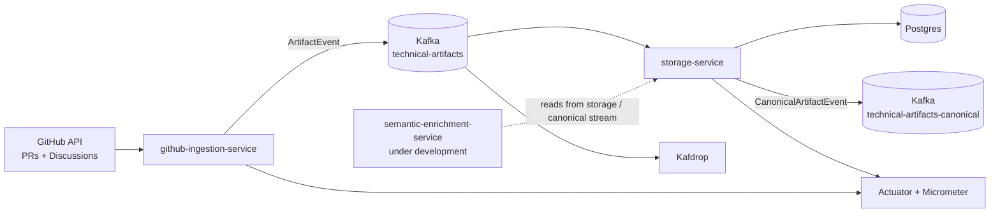
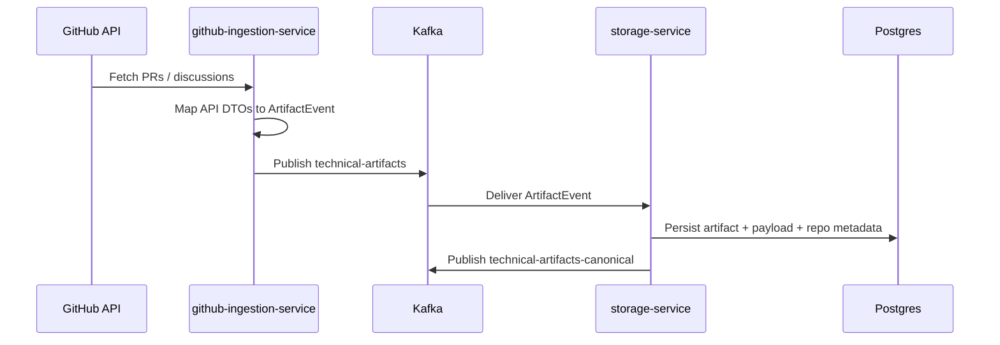

# ChangeOwl 🦉
> **The System Design Reasoning Engine**

ChangeOwl is a multi-module, event-driven platform for turning engineering activity into structured technical intelligence. The current v1 pipeline ingests GitHub pull requests and discussions, normalizes them into canonical events, streams them through Kafka, and persists them for downstream enrichment and analysis.

## What’s in this repo

### Microservices & Module Breakdown

- **`github-ingestion-service`**
  - Spring Boot service that periodically pulls GitHub PRs and discussions.
  - Maps GitHub API responses into the shared `ArtifactEvent` model.
  - Publishes events to Kafka topic `technical-artifacts`.
  - Exposes basic Micrometer/Prometheus metrics and health endpoints.

- **`storage-service`**
  - Kafka consumer that receives `ArtifactEvent` messages.
  - Persists artifacts to Postgres via Spring Data JPA.
  - Stores raw artifact payload and repository/technology linkage data.
  - Republishes a canonical event to `technical-artifacts-canonical` after successful persistence.

- **`changeowl-shared`**
  - Shared contract module used by both services.
  - Contains common event interfaces, canonical event models, and Kafka topic names.

- **`semantic-enrichment-service`**
  - Currently under development.
  - Planned for semantic enrichment, clustering, embeddings, and higher-level reasoning on top of stored artifacts.

### Infrastructure

- **Kafka** in KRaft mode for event streaming
- **Kafdrop** for topic and consumer inspection
- **Postgres** with **pgvector** support for storage and future vector/semantic workflows
- **Docker Compose** for local infra bootstrapping

## High-level architecture



## Event flow



## Current implementation status

### Phase 1: Data foundation and ingestion pipeline

What is already implemented:

- Maven multi-module setup with a shared parent POM
- Shared event and topic definitions in `changeowl-shared`
- GitHub ingestion client for PRs and discussions
- DTO-to-domain mapping layer for canonical artifact events
- Kafka producer for the ingestion service
- Kafka consumer, persistence layer, and canonical republishing in storage
- Basic observability with logs, timers, counters, and actuator endpoints
- Local infrastructure for Kafka, Kafdrop, and Postgres/pgvector

### Active work

- `semantic-enrichment-service` is being built next
- future work will focus on semantic enrichment, entity extraction, embeddings, and trend synthesis

## Tech stack

- **Language:** Java 21
- **Build tool:** Maven multi-module
- **Framework:** Spring Boot 3.x
- **Messaging:** Apache Kafka
- **Persistence:** PostgreSQL + Spring Data JPA (Hibernate)
- **Observability:** Spring Boot Actuator, Micrometer
- **Serialization:** Jackson, Spring Kafka JSON serializers/deserializers
- **Utilities:** Lombok
- **Local infra:** Docker Compose, Kafdrop, pgvector

## Repository layout

```text
changeowl/
├── changeowl-shared/
├── services/
│   ├── github-ingestion-service/
│   └── storage-service/
├── infra/
└── docs/
```

## Data sources

- GitHub pull requests
- GitHub discussions

## Current delivery focus

The repo is currently in a stable state for end-to-end ingestion and storage. The next milestone of v1 is semantic enrichment, which will build on the canonical artifact stream already produced by the storage layer.
